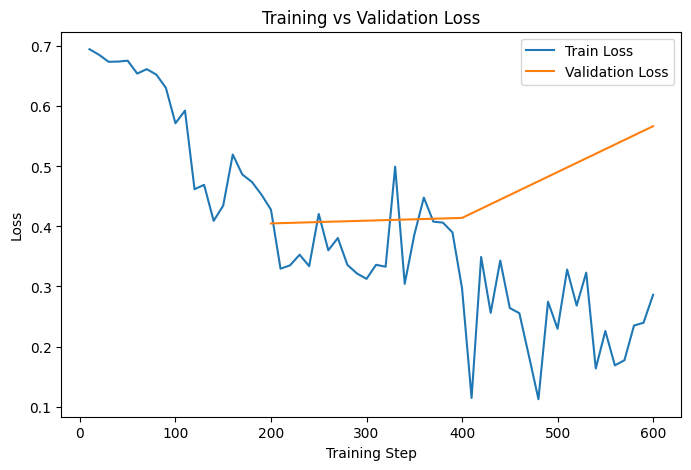
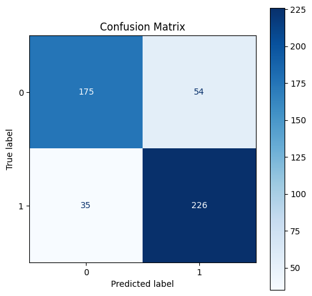

## Project Overview

This project explores the task of automatic sexism detection in Spanish tweets using transformer-based models. The goal is to classify tweets as sexist or non-sexist, a challenging task due to the presence of implicit language, sarcasm, and contextual meaning.

The system is built by fine-tuning a pretrained transformer model on the [EXIST dataset](https://nlp.uned.es/exist2025/) and evaluating its performance using standard classification metrics. In addition to model training, the project includes training dynamics analysis, confusion matrix visualization, and detailed error analysis.

This work highlights both the potential and the limitations of NLP models when applied to socially sensitive tasks such as online sexism detection.

## Dataset

The experiments use the [EXIST dataset](https://nlp.uned.es/exist2025/), which contains Spanish tweets annotated for sexism detection. Key characteristics:

- Language: Spanish
- Task: Binary classification
- Labels:
    - 0: Non-sexist
    - 1: Sexist
- Annotations obtained through majority voting among human annotators

Because sexism can be expressed implicitly or contextually, the dataset contains inherently ambiguous examples, which makes the classification task particularly challenging.

## Approach

The project focuses on fine-tuning a transformer model for sequence classification. The main steps that where followed are:

1. Text preprocessing
    - Basic normalization
    - Replacement of mentions (@user) with ``[USER]``
    - Replacement of URLs with ``[URL]``
    - Tokenization using a pretrained transformer tokenizer
2. Model fine-tuning
    - Transformer-based model adapted for binary classification
    - Training performed using the HuggingFace Trainer API
3. Evaluation
    - Accuracy
    - Precision
    - Recall
    - F1-score
4. Error analysis
    - Confusion matrix
    - Inspection of false positives
    - Inspection of false negatives

## Training Dynamics

The evolution of training and validation loss during fine-tuning is shown below.

The training loss consistently decreases across epochs, indicating that the model successfully learns patterns from the training data. However, the increase in validation loss in later epochs suggests the beginning of overfitting, indicating that the optimal performance is reached earlier in the training process.

## Results

Final evaluation results on the test set:

| Metric    | Score |
| --------- | ----- |
| Accuracy  | 0.83  |
| Precision | 0.84  |
| Recall    | 0.83  |
| F1-score  | 0.83  |

Detailed class-level results:

| Class      | Precision | Recall | F1   |
| ---------- | --------- | ------ | ---- |
| Non-sexist | 0.77      | 0.90   | 0.83 |
| Sexist     | 0.90      | 0.76   | 0.83 |

These results show that the model performs well overall, with strong precision for detecting sexist tweets but slightly lower recall, meaning some sexist tweets remain difficult to detect.

## Confusion Matrix

The confusion matrix provides insight into the model's prediction behavior:

The model shows strong performance in identifying non-sexist tweets, while some sexist tweets are misclassified. This behavior is consistent with the inherent difficulty of detecting implicit or context-dependent sexism.

## Error Analysis

The inspection of misclassified examples reveals several sources of difficulty. In the case of **false positives**, there were tweets containing strong or offensive language not necessarily directed at women, as well as instances of irony or humor that may have resembled sexist language patterns.

On the other hand, **false negatives** contained implicit sexism without explicit offensive words, context-dependent statements, or subtle stereotypes. These cases illustrate the limitations of purely text-based models when dealing with nuanced social phenomena.
